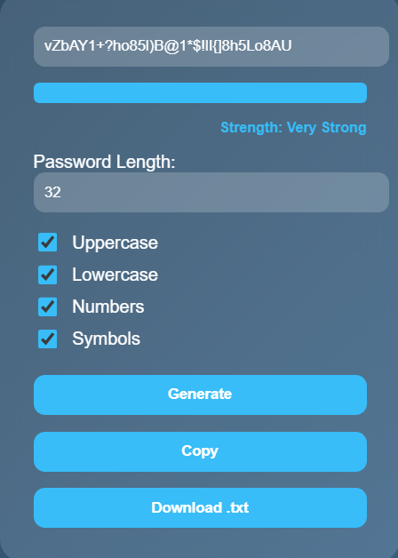
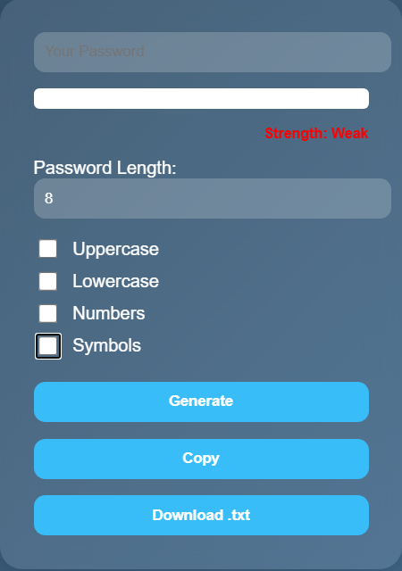
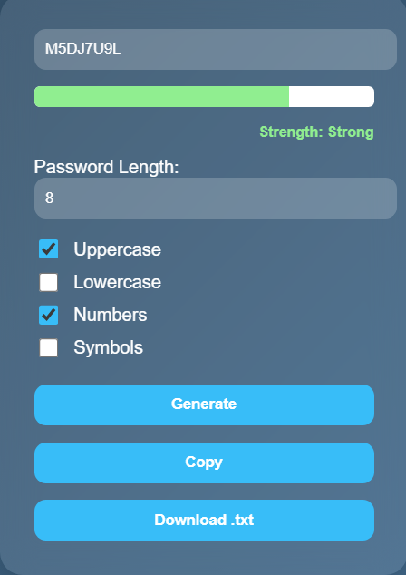
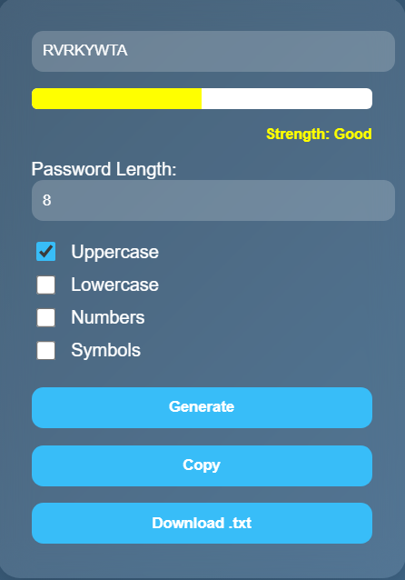
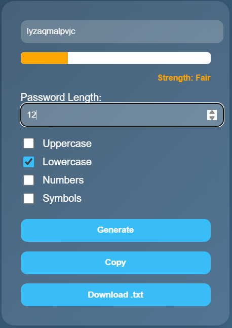

# Password Generator App

A clean, modern password generator built using **HTML**, **CSS**, and **JavaScript**. It lets users generate secure, random passwords with configurable options for length and character types.

---

## 💻 Live Demo

- [⛓️‍💥 Demo](https://web-password-generator-eight.vercel.app/)

---

## 📷 Screenshots

<p align="center">
  
</p>

<br>

<p align="center">
  
  
</p>

<br>

<p align="center">
  
  
</p>

---

## 🔐 Features

- Generate strong, random passwords
- Configurable length (4–32 characters)
- Toggle options: uppercase, lowercase, numbers, symbols
- Password strength indicator
- Copy password to clipboard
- Download password as `.txt` file
- Responsive and mobile-friendly layout
- Instant updates on option changes

---

## 🚀 Getting Started

### 1. Clone the repository

```bash```
git clone https://github.com/xAndreiix/Web_Password_Generator.git

cd password-generator-app

### 2. Open in browser
Just open index.html directly in your browser. No dependencies required.

---

## 📁 File Structure

- password-generator-app/
- │
- ├── index.html          # Main HTML file
- ├── style.css           # Styling and layout
- ├── script.js           # App logic and interactions
- ├── LICENSE             # MIT license
- └── README.md           # This file

---

## ⚙️ Tech Stack

- HTML5
- CSS3 (with glassmorphism + responsive layout)
- Vanilla JavaScript

---

## 📝 License
This project is licensed under the MIT License.
